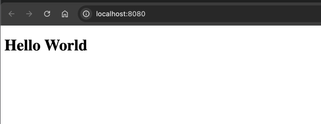

# Task 1
## Comments
- using "~/workspaces/fiskaly_q1" as workdir
- working locally on Mac and using local Docker Desktop
- chosen webserver (nginx) over custom Python application as we are serving static HTML content, for which a 3rd party webserver is much more adequate

## Steps
1. Prepare "index.html" file to configure desired output (Hello World)
1. Prepare "default.conf" file to configure desired listener port (8080) -> this was done only to met the requirement
1. Prepare simple Dockerfile based on nginx:alpine, using prepared "index.html" and "default.conf"
1. Build image
    ```
    docker build -t fiskaly-task1:1.0 .
    ```
1. Launch application (and publish port)
    ```
    docker run -p 8080:8080 fiskaly-task1:1.0
    ```
1. Verify via browser: http://localhost:8080/  
    
1. Verify accessibility of running container from rest of the network (theoretical checks):
- Nginx is listening on 0.0.0.0 within container:
    ```
    david@Davids-MacBook-Air fiskaly_q1 % docker exec -ti 96847a84a7c1 netstat -plnt | grep 8080
    tcp        0      0 0.0.0.0:8080            0.0.0.0:*               LISTEN      1/nginx: master pro
    tcp        0      0 :::8080                 :::*                    LISTEN      1/nginx: master pro
    ```
- Docker runtime is publishing container on port 8080 on 0.0.0.0:
    ```
    david@Davids-MacBook-Air fiskaly_q1 % sudo lsof -iTCP -sTCP:LISTEN -P -n | grep 8080        
    com.docke 35701 david  103u  IPv6 0xd24d52ef47f4c0e9      0t0  TCP *:8080 (LISTEN)

    ```
- There is no IP filtering or any similar configuration in used Nginx config
- TL;DR: In completely unsecures setup I should be able to reach the container from any device connected to my home network