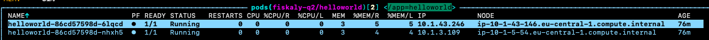
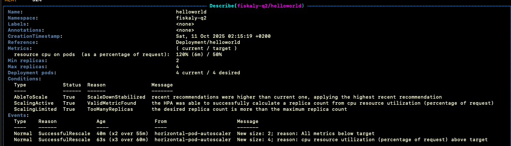

# Task 2
## Comments
- using "~/workspaces/fiskaly_q2" as workdir
- working on EKS cluster deployed in my personal AWS account as part of this excercise (Task 3)

## Steps - prerequisites
1. Build image from "Task 1" locally for amd64 architecture used in EKS (I am working on Mac)
    ```
    docker buildx build --platform linux/amd64 -t fiskaly-task1:1.0-amd64 --load ~/workspaces/fiskaly_q1
    ```
1. Authenticate into ECR
    ```
    aws ecr get-login-password --region eu-central-1 | docker login --username AWS --password-stdin 675261166794.dkr.ecr.eu-central-1.amazonaws.com
    ```

1. Tag and push into ECR
    ```
    docker tag fiskaly-task1:1.0-amd64 675261166794.dkr.ecr.eu-central-1.amazonaws.com/fiskaly-task1:1.0-amd64
    docker push 675261166794.dkr.ecr.eu-central-1.amazonaws.com/fiskaly-task1:1.0-amd64
    ```

1. Create NS for this task
    ```
    kubectl create ns fiskaly-q2
    ```

## Steps
1. Apply YAML manifests
    ```
    kubectl apply -R -f ./ -n fiskaly-q2
    ```

## Explanation
### Stage 1 - Initial deployment:
1. Create Deployment "helloworld"
    - we are using image from "Task 1" now loaded in ECR from local Docker
    - we configure simple deployment with 2 replicas
    - we configure a service "helloworld" of type "ClusterIP"
1. Create Deployment "nginx"
    - we are using off-the-shelf nginx image
    - we configure simple deployment with 1 replica
    - we configure custom ConfigMap for nginx to set reverse-proxy to "helloworld" service
    - we configure a service "nginx" of type "LoadBalancer" to publish the service in AWS
1. We verify setup by accessing AWS LB:  
   

### Stage 2 - scaling:
1. We configure HPA for "helloworld" Deployment
1. We configure "helloworld" Deployment with ridiculously low resources configuration to allow for HPA testing with low effort
1. We check current replica count of "helloworld" Deployment:

1. We execute local stress-test to force some load on "helloworld" Deployment:
    ```
    echo "http://a59a98395830c451aabebc39a6f5638d-1968619516.eu-central-1.elb.amazonaws.com:80" > urls
    http_load -rate 100 -seconds 300 urls
    ```
1. We verify that generated load triggered HPA and Deployment scale-up:
  - We check current replica count of "helloworld" Deployment:
  - We check HPA history:
    

### Stage 3 - basic network security implemented:
1. Added network policies to limit traffic to "helloworld" only from "nginx" + open traffic to "nginx" from everywhere

### Stage 4 - other setup 
- As someone who worked on multi-tenant clusters and enforced proper/secure/best-practice configuration via Kyverno, I will rather list some of the practices I would follow:
    - every pod/container should:
        - have resource requests/limits configured
        - use internal image registry such as Nexus/Artifactory/ECR etc.
        - use "Always" imagePullPolicy
        - use custom non-default SA
        - have proper securityContext (no running as root, no privilege escalation, no custom seccomp/selinux setup etc.)
        - NOT use "hostNetwork: true"
        - NOT use volumes of type "hostPath"
        - NOT use "hostPort"

    - underlying NS should:
        - deploy default netPol with DENY:DENY rule to force user to use netpols
        - deploy resourceQuota to limit cpu/mem/pods that can be consumed by NS
        - deploy limitRange to limit maximum mem/cpu used by single pod
